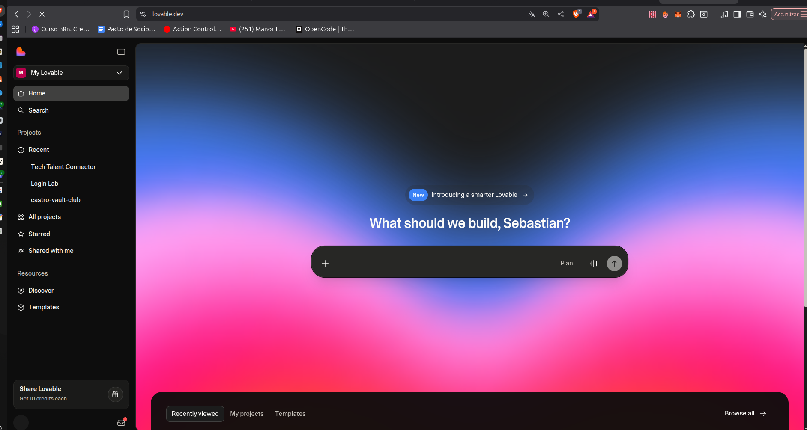
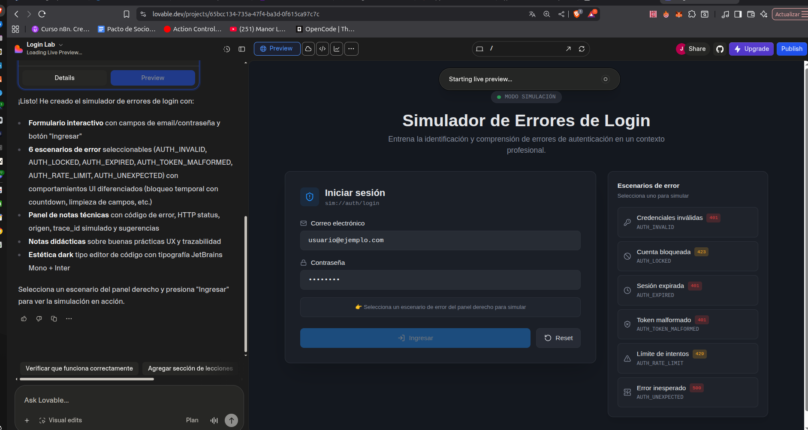

# Guía de Uso de Lovable

Esta guía te ayudará a usar Lovable.dev efectivamente durante el reto de 30 minutos.

---

## Paso 1: El "Mega-Prompt" Inicial (Minuto 2-7)

**IMPORTANTE:** NO pidas un botón. Pide el software completo.

### Ejemplo de Prompt para Logística:

```
Crea un dashboard moderno y oscuro para una empresa de logística. 

LAYOUT:
- Barra lateral izquierda con navegación
- Centro: Mapa interactivo con camiones en movimiento
- Derecha: Lista de alertas críticas generadas por IA

ALERTAS:
- "Retraso por tormenta en Ruta 45"
- "Paquete dañado detectado - ID: PKG-8821"
- "Predicción: Entrega tardía 85% confianza"

ESTILO:
- Colores neón para alertas críticas (rojo, amarillo)
- Tipografía moderna y limpia
- Animaciones sutiles en las alertas
- Tema oscuro profesional
```

**Para más ejemplos de prompts, consulta:** [EJEMPLOS_PROMPTS.md](EJEMPLOS_PROMPTS.md)

---

## Paso 2: Iteración Visual (Minuto 7-22)

Refina la UI hablando con la IA. Ejemplos:

```
"Haz que las alertas rojas parpadeen suavemente"
"Agrega un gráfico de barras de eficiencia debajo del mapa"
"Cambia la tipografía a una monoespaciada tipo hacker"
"Añade un panel de estadísticas con números grandes"
"Haz que el mapa tenga marcadores animados"
```

**Tip:** Sé específico. En lugar de "hazlo mejor", di "aumenta el tamaño de los títulos a 24px y hazlos bold".

---

## Paso 3: Conexión a GitHub (Minuto 22-27)

**Esto es crucial para demostrar que eres DEV, no solo diseñador.**

1. En Lovable, clic en el **icono de GitHub** (esquina superior derecha)
2. Autorizar tu cuenta de GitHub
3. Crear nuevo repositorio:
   - Nombre: `reto-ia-[tu-nombre]-[industria]`
   - Ejemplo: `reto-ia-juan-logistica`
4. **Push changes** desde Lovable
5. **Bonus:** Activar deploy automático para tener URL pública

---

## Recursos de Lovable

### Herramientas Integradas

- **TailwindCSS** - Framework CSS (ya incluido)
- **Lucide Icons** - Iconos modernos
- **shadcn/ui** - Componentes React
- **Deploy automático** - URL pública instantánea

### Interfaz de Lovable

#### Vista Principal (después del registro)
Esta es la pantalla inicial que verás al entrar a Lovable:



#### Dashboard de Construcción
Una vez que comienzas a construir tu aplicación con prompts:



### Inspiración de UI

- [Dribbble - Dashboards](https://dribbble.com/tags/dashboard)
- [Behance - AI Interfaces](https://www.behance.net/search/projects?search=ai+interface)

---

## Tips para Maximizar tu Tiempo

### 1. Usa el Mega-Prompt
No construyas componente por componente. Describe la visión completa desde el inicio.

### 2. Itera Incrementalmente
Haz cambios pequeños y específicos en cada iteración.

### 3. Prioriza lo Visual
En 30 minutos, el impacto visual es más importante que la funcionalidad compleja.

### 4. Muestra Elementos de IA
Incluye siempre:
- Niveles de confianza (ej: "87% seguro")
- Explicaciones ("Recomendado porque...")
- Predicciones ("Estimado: 2 horas")

---

## Soporte

### ¿Tienes dudas?

- **Durante el reto:** Levanta la mano o pregunta en el chat
- **Problemas técnicos con Lovable:** [Documentación oficial](https://docs.lovable.dev)

---

## Recursos Adicionales

### Para profundizar después del reto:

- [Guía de Prompt Engineering](https://www.promptingguide.ai/)
- [Curso de IA Generativa](https://www.deeplearning.ai/short-courses/)
- [Playground de OpenAI](https://platform.openai.com/playground)
